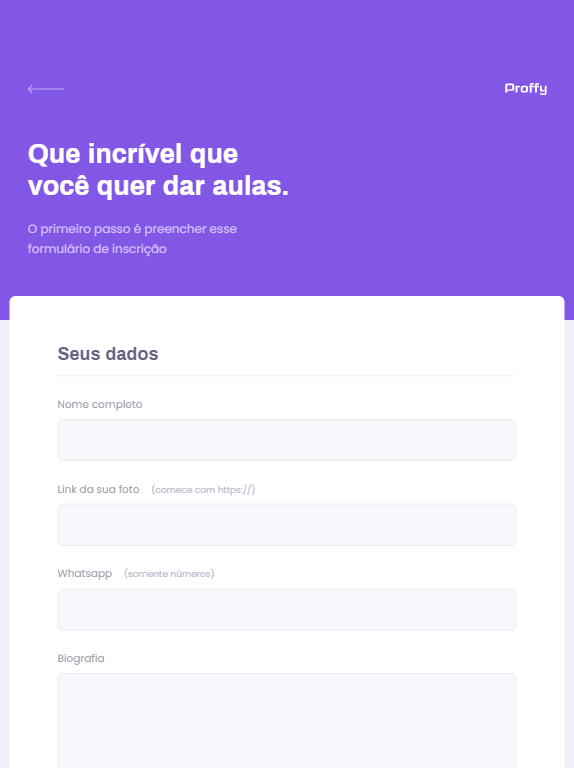
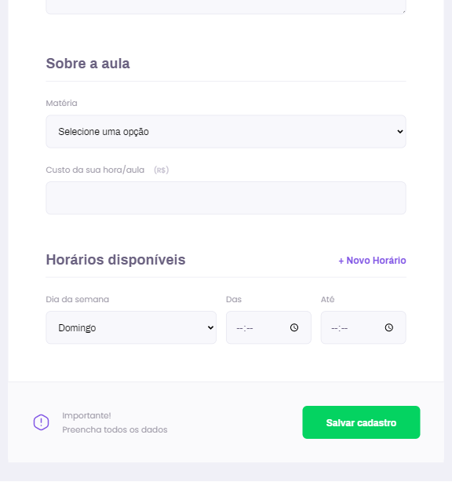

<h1 align="center">
    
</h1>

    <h1>
        
        
    </h1>
    <h1>
        
        
    </h1>

    Page developed for students that need a specific class and also for teacher who need an extra change

  <a href="#why">Why</a> •
  <a href="#roadmap">Roadmap</a> •
  <a href="#install-instructions">Install instructions</a> •
  <a href="#tech-stack">Tech Stack</a> •
  <a href="#author">Author</a> •
  <a href="#contributing">Contributing</a> •
  <a href="#license">License</a> •

## Why?

This app was created in a bootcamp called Next Level Week #2. 
It's only purpose is to teach new useful technologies to begginers that didnt had contact with web development.

## Roadmap

-   [x] Introduction to web development
-   [x] Dev worsktation: Chrome and VSCode
-   [x] Introduction to Front and Back-end
-   [x] Introduction and coding in HTML for the Front-end
-   [x] Introduction, coding and integration of CSS in the HTML file
-   [x] Responsive CSS: Mobile First and Box Model
-   [x] Introduction and coding in JavaScript for the back-end
-   [x] Download and configuration of NodeJs
-   [x] Download and configuration of GitBash in VSCode to setup our enviroment 
-   [x] Download and configuration of SQLite for the local database
-   [x] Using node package manager of NodeJs to install and configure our "express" Server in Js
-   [x] Using node package manager of NodeJs to install and configure our "nunjucks" Template Engine
-   [x] Using SQLite to manage our local SQL data base
-   [ ] Confirmation page after register as a teacher
-   [ ] Remove time option in register page for teachers
-   [ ] More ways to communicate with the teacher, like: E-mail, Discord, Etc

Check this notion [link](https://www.notion.so/Class-Notes-77051ca2cd794b7494a3defcbe598627) if you want a more detailed roadmap. Obs: It's in portuguese!

## Install instructions

### Getting Started

#### 1) Clone & Install Dependencies

- 1.1) `git clone https://github.com/joaohutner/NLW_Proffy`
- 1.2) `NLW_Proffy` - cd into your newly created project directory.
- 1.3) Install NPM packages with `npm install`
        **Note:** We are not using React Native so we can use `npm` instead of `yarn`.
        
#### 2) Start your app

- 2.1) In Bash command live run the web page, run `npm run dev`. The first build will take some time.
- 2.2) The server will start in <http://localhost:5500> 

## Tech Stack

-   [SQLite](https://www.sqlite.org/index.html)
-   [NodeJS](https://nodejs.org/en/)

## Author

* **João Hütner** - *All work* - [Linkedin](https://www.linkedin.com/in/joao-victor-hutner/)

## Contributing

Feel free to submit pull requests to me.

## License

This project is licensed under the [MIT License](https://opensource.org/licenses/MIT).
